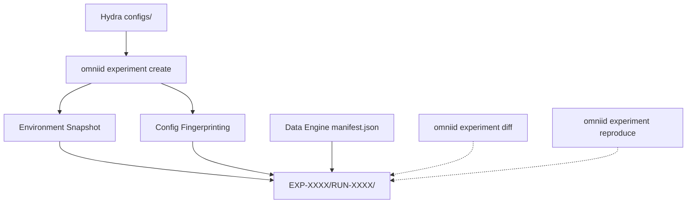

# Experiment Management & Configuration Framework (EMCF) Guide

## Overview
The EMCF is OmniID's rigid orchestrator for hyperparameter sweeps, architecture ablations, and dataset version tracking. It strictly splits **Experiments** from **Runs**.

- **Experiment** (`EXP-0001`): A conceptual grouping (e.g., `baseline`, `pretraining`, `synthetic_ablation`).
- **Run** (`RUN-0001`): A singular deterministic execution within an experiment.

## Architecture


## Creating a Run
```bash
omniid experiment create experiment=baseline dataset=synthetic_v1 model=dinov2 seed=42
```
This generates:
```text
experiments/
  EXP-0001/
    RUN-0001/
      config.yaml
      config_fingerprint.txt
      environment.json
      artifact_manifest.json
      run_metadata.json
      metrics.json
      logs/
```

## Diffing Configurations
To precisely identify what changed between two experiments without digging through `git diff`:
```bash
omniid experiment diff EXP-0001 EXP-0002
```
*Outputs exactly which keys shifted (e.g., `model.lr: 0.001 -> 0.005`).*

## Reproducing a Run
To hot-load the exact pipeline configuration, seed, and dataset fingerprint of a prior run:
```bash
omniid experiment reproduce EXP-0001
```
