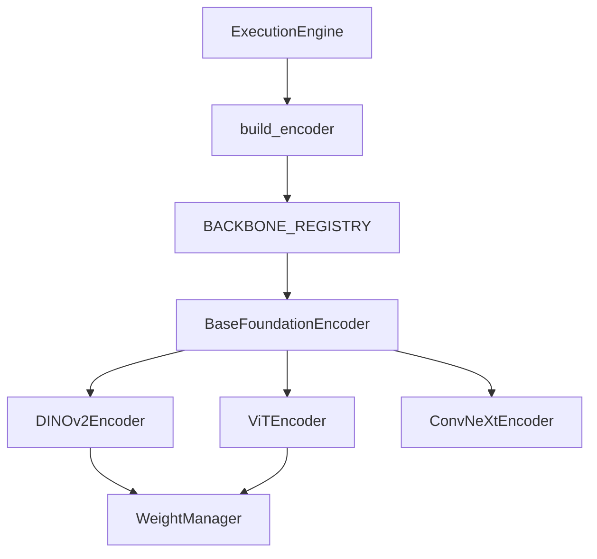

# Foundation Encoder Framework (FEF) Guide

## Overview
The FEF integrates pretrained neural network architectures (DINOv2, ViT, ConvNeXt) seamlessly into OmniID. It strictly decouples model implementations from the execution engine via the `BaseFoundationEncoder` contract and the `BACKBONE_REGISTRY`.

## Architecture


## Encoder Contract
Every encoder guarantees support for:
1. **Mode Extraction**: `encode(image, mode="cls"|"patch"|"pooled")`.
2. **Standardized Preprocessing**: Encoders natively expose their required normalizations via `get_preprocessing_transforms()`.
3. **Property Reflections**: Encoders reflect their own dimensionality (`embedding_dim`), `patch_size`, and `input_resolution`.

## Benchmarking
Before ever touching a training loop, encoders can be dry-run and profiled via the Benchmark CLI:
```bash
omniid models benchmark dinov2
```
Outputs latency in seconds, raw parameter counts, and tensor output shapes for sanity checking model integration.
