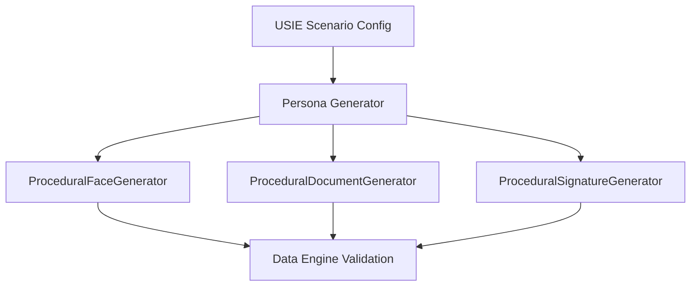

# Universal Synthetic Identity Engine (USIE) Guide

## Overview
The USIE is a dedicated sub-system of OmniID meant for scenario-driven generation of synthetic identities. Since real biometric and identity documents are highly regulated, USIE creates statistically significant surrogate datasets for training and CI/CD validation.

## Architecture


## Reproducibility
USIE strictly enforces random seeds. Calling `generate(seed=42)` guarantees identical identity arrays (Names, DOBs, rendered noise patterns).

## Usage
```python
from omniid.synthetic import SyntheticIdentityGenerator

generator = SyntheticIdentityGenerator()
generator.generate(
    scenario="passport_verification",
    count=1000,
    seed=42,
    output_dir="./synthetic_dataset",
    profile="noisy"
)
```

## Limitations
Procedural artifacts are useful for pipeline validation and Data Engine stability checks, but they **cannot** be used to benchmark true Foundation Model accuracy (as the biometric features lack high-frequency organic variation). Later phases will introduce `DiffusionFaceGenerator` for photorealistic synthesis.
