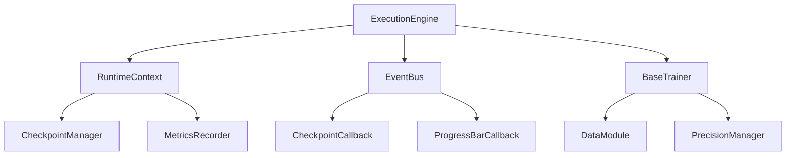

# Training & Execution Engine (TEE) Guide

## Overview
The TEE provides the runtime orchestration required to scale OmniID into a robust Foundation Model framework. Rather than tightly coupling datasets, models, and optimization logic, the TEE abstracts hardware acceleration, ML lifecycles, and event dispatching.

## Architecture

## The Execution Engine
The `ExecutionEngine` wraps the standard trainer. It guarantees that if an exception fires mid-training, the state gracefully falls back to `FAILED` and an `on_exception` event is broadcasted across the `EventBus` to notify logging telemetry.

## Checkpoint Standards
OmniID Checkpoints do not just save `.pt` tensor binaries. Our checkpoints inject the exact `config_fingerprint.txt` string and the exact schema versions active at save-time. This structurally enforces reproducibility, meaning a run can be loaded years later and OmniID will know exactly which seed and augmentations generated it.
